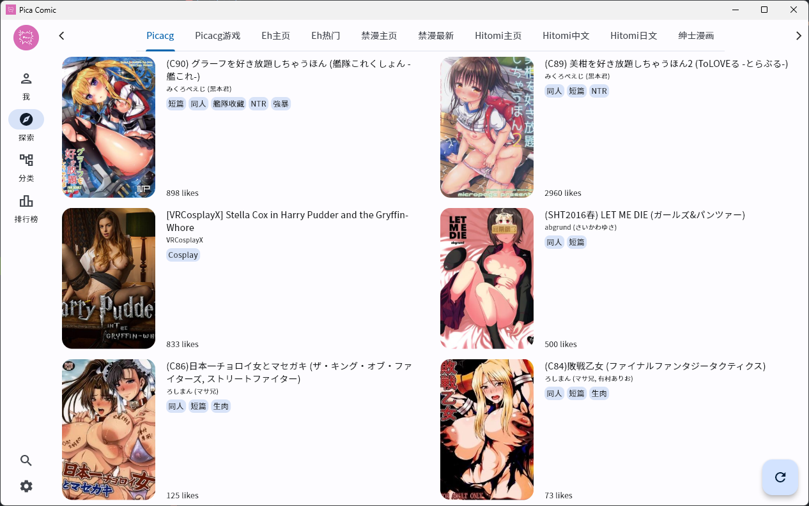
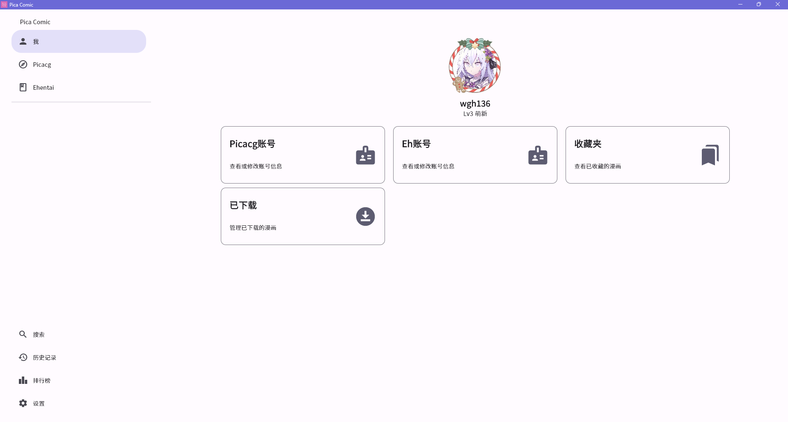
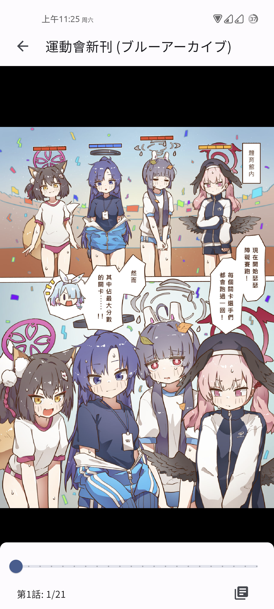
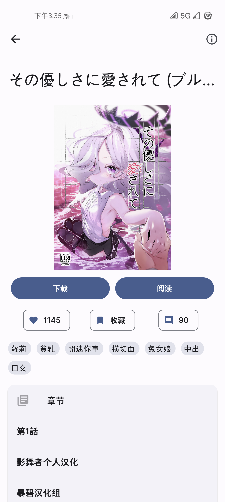
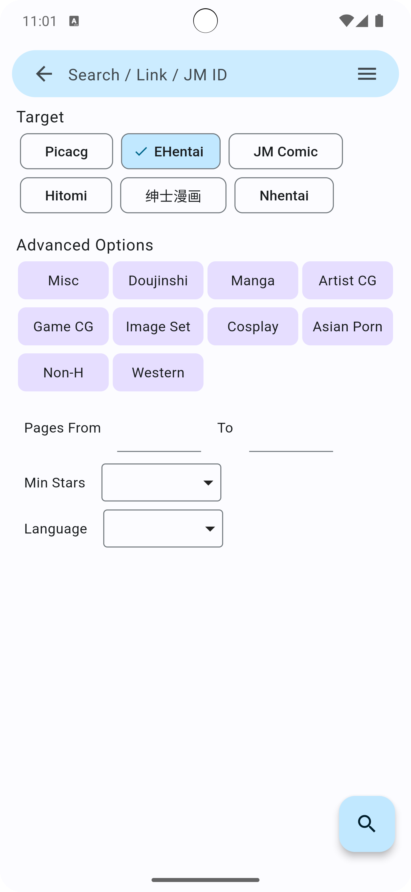
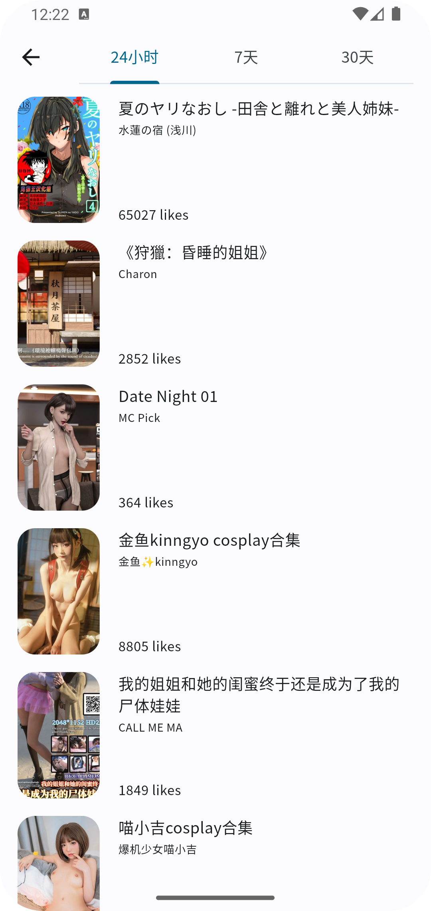
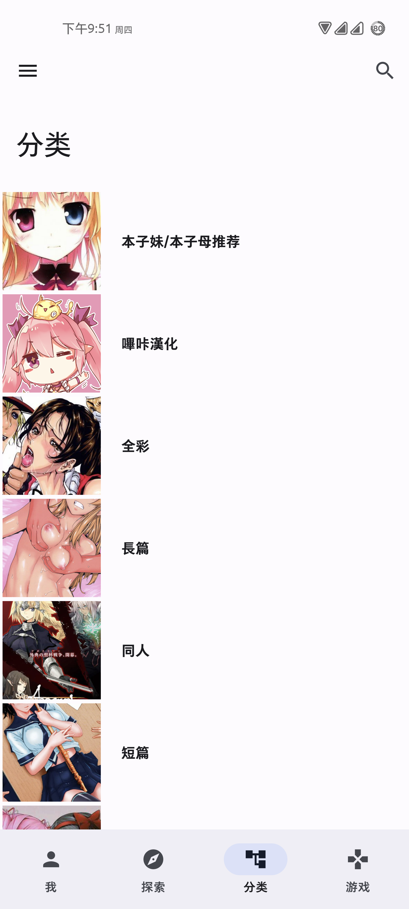
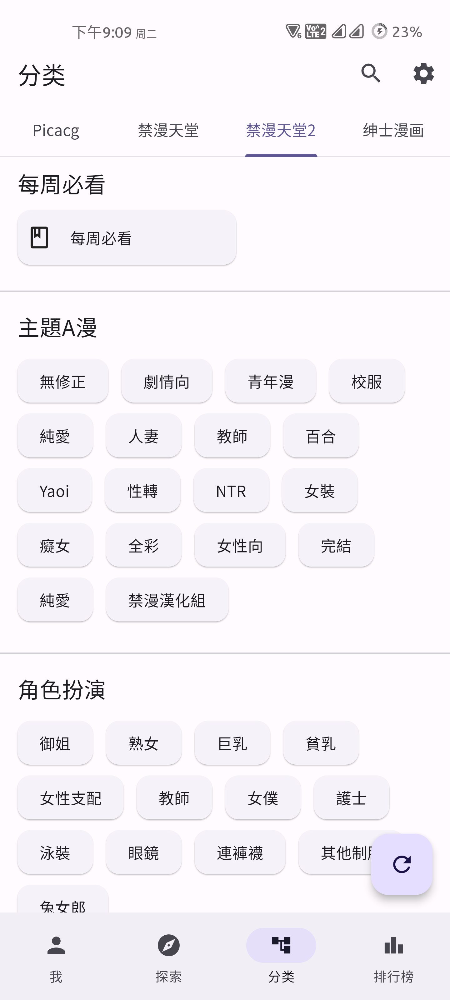

# Pica Comic

 

A comic app with multiple sources built with flutter.

## Introduction

### Built-in Comic Source

Currently, Pica Comic has 5 built-in comic sources:
- picacg
- e-hentai/exhentai
- jmcomic
- hitomi
- 绅士漫画
- nhentai

### Custom Comic Source

You can add custom comic sources in the app after version 3.0.0.

### Features

- Browse manga
- Online reading
- Download manga
- Manage local favorites and network favorites
- Data sync(using webdav)
- Reading history

### History

This project initially started as an unofficial app for picacg 
and later evolved into an app that supports multiple comic sources.

## Build From Source Code
See [https://docs.flutter.dev/](https://docs.flutter.dev/)

## Thanks

### Projects

The image restructuring algorithm used to display jm images is from this project.

### Tags Translation

The Chinese translation of the manga tags is from this project.

## Screenshots

